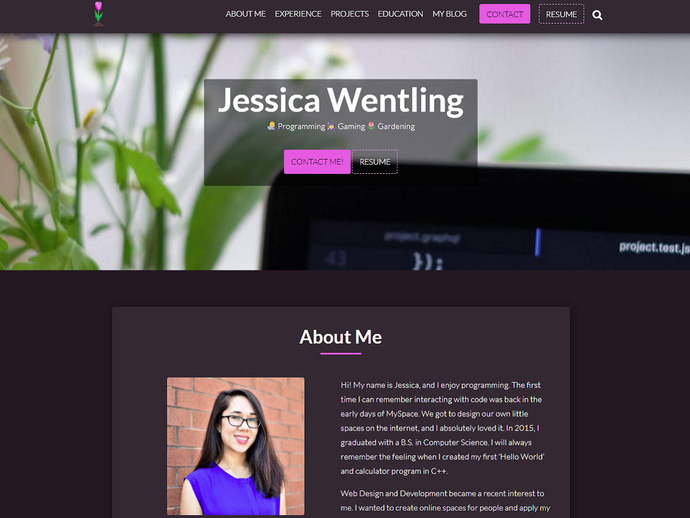

# Personal Website v2

This is [version 2](https://jessicawentling.com) of my personal site. I took the look of [version 1](https://v1.jessicawentling.com) and recreated/updated it using SCSS. I also transfered it to WordPress by creating my own theme from scratch.

## Technologies used

- HTML
- SCSS
- JavaScript
- PHP
- WordPress
- REST API
- React
- GitHub

## Upgrades from v1

- Added a blog with comment section
- Added an Education & Certificate section to the homepage
- Added a live search function to search blog posts
- Created a custom plugin that adds custom experience, projects, and education blocks so I can change the information on the homepage from the admin side.

## TODO

- Create contact form
